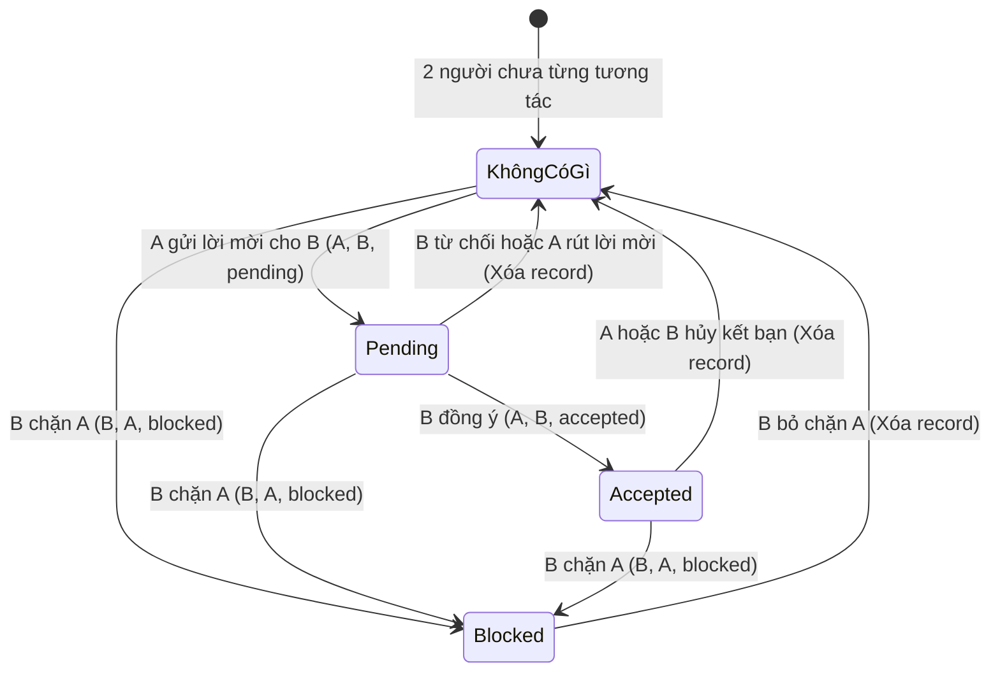

# Workflow Tính Năng Kết Bạn (Friendships)

Dưới đây là luồng hoạt động (Workflow) và các quy tắc nghiệp vụ (Business Rules) chi tiết cho tính năng Bạn bè. Dựa trên mô hình lưu trữ **1 dòng duy nhất (Single Record)**, mọi trạng thái giữa 2 người dùng (A và B) sẽ được quản lý qua bảng `friendships`.

## 1. Trạng thái quan hệ (Friendship Status)
- `pending`: Đang chờ đồng ý (Người ở `user_id` là người gửi, `friend_id` là người nhận).
- `accepted`: Đã là bạn bè (Cả 2 đều thấy nhau là bạn, không phân biệt ai là `user_id`).
- `blocked`: Đã bị chặn (Người ở `user_id` là người đã thực hiện hành động chặn).

## 2. Sơ đồ chuyển đổi trạng thái (State Machine)

Biểu đồ dưới đây thể hiện luồng thay đổi dữ liệu khi có các thao tác từ người dùng.



> [!NOTE]
> Khi B chặn A, hệ thống sẽ xóa/cập nhật mọi trạng thái hiện tại (nếu có) thành `user_id = B`, `friend_id = A`, `status = 'blocked'`.

---

## 3. Quy tắc API (API Workflow)

### 3.1. Gửi lời mời kết bạn (Send Request)
- **API**: `POST /api/friendships/request/{targetUserId}`
- **Logic**:
  1. Kiểm tra 2 người đã là bạn hoặc đã có lời mời chưa.
  2. Kiểm tra `targetUserId` có đang chặn người gửi không (Nếu dòng dữ liệu là `user_id = B, friend_id = A, status = 'blocked'` -> Báo lỗi không tìm thấy người dùng hoặc không được phép).
  3. Tạo mới record: `user_id = A, friend_id = B, status = 'pending'`.

### 3.2. Trả lời lời mời kết bạn (Accept / Reject)
- **API**: `PUT /api/friendships/accept/{id}` hoặc `DELETE /api/friendships/reject/{id}`
- **Logic**:
  1. Chỉ người nhận (`friend_id = B`) mới có quyền Accept hoặc Reject.
  2. Nếu Accept: Đổi `status` thành `'accepted'`.
  3. Nếu Reject: Xóa (DELETE) record khỏi database.

### 3.3. Hủy kết bạn (Unfriend)
- **API**: `DELETE /api/friendships/{friendId}`
- **Logic**:
  1. Tìm dòng có `(A, B)` hoặc `(B, A)` với `status = 'accepted'`.
  2. Xóa record khỏi database. Cả 2 trở thành người lạ.

### 3.4. Chặn và Bỏ chặn (Block / Unblock)
- **API Block**: `POST /api/friendships/block/{targetUserId}`
  - **Logic**: 
    - Xóa các lời mời hoặc quan hệ bạn bè đang có.
    - Cập nhật/Tạo dòng dữ liệu mới cứng: `user_id = A, friend_id = B, status = 'blocked'`.
- **API Unblock**: `DELETE /api/friendships/unblock/{targetUserId}`
  - **Logic**: 
    - Chỉ người thực hiện chặn (`user_id = A`) mới được Unblock.
    - Xóa dòng dữ liệu đó đi.

---

## 4. Lấy danh sách (Query Data)

- **Lấy danh sách bạn bè của A**:
  ```sql
  SELECT * FROM friendships 
  WHERE status = 'accepted' AND (user_id = A OR friend_id = A)
  ```
- **Lấy danh sách lời mời A NHẬN được**:
  ```sql
  SELECT * FROM friendships WHERE friend_id = A AND status = 'pending'
  ```
- **Lấy danh sách lời mời A ĐÃ GỬI**:
  ```sql
  SELECT * FROM friendships WHERE user_id = A AND status = 'pending'
  ```
- **Lấy danh sách A ĐANG CHẶN**:
  ```sql
  SELECT * FROM friendships WHERE user_id = A AND status = 'blocked'
  ```

> [!IMPORTANT]
> Khi load thông tin Profile của một User khác, cần kiểm tra xem họ có đang trong trạng thái `blocked` với mình hay không để quyết định ẩn/hiện nút "Kết bạn" hay hiển thị báo lỗi.
